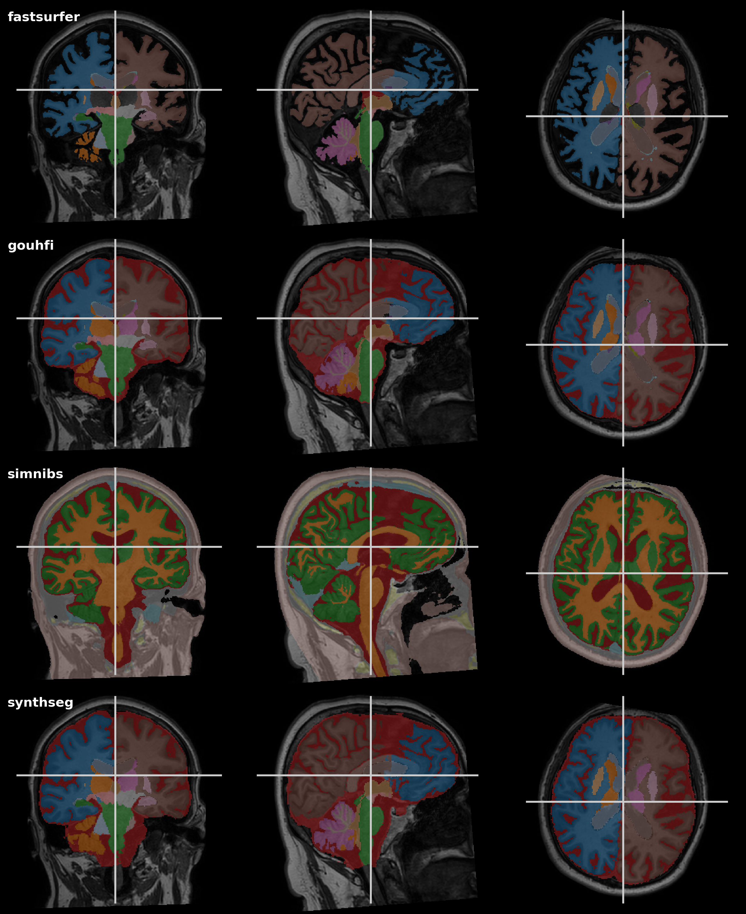

# BrainSeg Pipeline

This repository contains a streamlined **Snakemake pipeline** to automatically run and compare state-of-the-art brain segmentation tools on your MRI data.

Brain segmentation tools often have conflicting dependencies, complex installation steps, or require specific versions of system libraries. This pipeline solves that problem by handling the environment setup, execution, and result standardization for you.


## The Tools

This pipeline currently supports the following deep-learning-based segmentation tools. We may add more in the future.

1. [**GOUHFI**](https://github.com/mafortin/GOUHFI)
   This tool was designed to handle the challenges of Ultra-High Field MRI (7T+). It utilizes "domain randomization" during training, which allows it to remain robust across different MRI contrasts and resolutions, including standard clinical scans.

   * **Resolution:** Native (preserves input resolution).

   * **CSF Availability:** Yes (segments ventricles and subarachnoid space CSF).

2. [**SynthSeg**](https://github.com/BBillot/SynthSeg)
   Developed by the FreeSurfer team, this tool is famous for working "out of the box" on almost any kind of MRI scan (different contrasts, resolutions, or messy clinical data) without needing retraining.

   * **Resolution:** Fixed 1mm isotropic (always resamples input to 1mm).

   * **CSF Availability:** Yes.

3. [**FastSurfer**](https://github.com/Deep-MI/FastSurfer)
   A rapid deep-learning-based segmentation tool that is optimized for speed, finishing in minutes rather than hours.

   * **Resolution:** Native (but experimental below 0.7mm).

   * **CSF Availability:** No (segments ventricles, but ignores subarachnoid space CSF).

4. [**SimNIBS (Charm)**](https://github.com/simnibs/simnibs)
   The "Complete Head Anatomy Reconstruction Method" from the SimNIBS suite. While designed for modeling brain stimulation (TMS/TES), it produces high-quality segmentation of extra-cerebral tissues (skull, scalp, etc.) in addition to the brain.

   * **Resolution:** Native (pipeline uses the upsampled output to match input).

   * **CSF Availability:** Yes.
   * **Segmented regions:** Charm provides the following segmentation labels: White-Matter, Gray-Matter, CSF, Bone, Scalp, Eye_bals, Compact_bone, Spongy_bone, Blood, Muscle, Cartilage, Fat, Electrode, Saline_or_gel

## Comparison Output

The pipeline can automatically generate a comparison grid so you can quickly inspect the differences between the tools.

*Note: The pipeline includes a script (`scripts/compare_segs.py`) that generates this visualization for you.*

## Getting Started

### Prerequisites

You need a package manager to handle the software environments. We recommend **Mamba** (faster) or **Conda**. You also need **Snakemake**.

```
# Install Snakemake using Mamba (recommended)
mamba create -c conda-forge -c bioconda -n snakemake snakemake
mamba activate snakemake

```

### Installation

Clone this repository:

```
git clone [https://github.com/yourusername/brainseg.git](https://github.com/yourusername/brainseg.git)
cd brainseg

```

## Usage

1. **Prepare your data:**
   Place your T1-weighted MRI files in the `inputs/` folder.

   * *Naming convention:* Files must end in `_T1w.nii.gz`.

   * *Example:* `inputs/sub-01_T1w.nii.gz`

2. **Run the pipeline:**
   Execute Snakemake. This command tells it to use the conda environments defined in the repo and run on 1 core (increase cores if you have them).

   ```
   snakemake --use-conda -c 1
   
   ```

   *First run note:* The first time you run this, Snakemake will download all necessary model weights and build the separate environments for each tool. This might take a while!

## Output Structure

After the pipeline finishes, your `results/` folder will look like this:

```
results/
└── sub-01/
    ├── fastsurfer_seg.nii.gz  # FastSurfer Segmentation
    ├── gouhfi_seg.nii.gz      # GOUHFI Segmentation
    ├── simnibs_seg.nii.gz     # SimNIBS/Charm Segmentation
    └── synthseg_seg.nii.gz    # SynthSeg Segmentation

```

### Note on Labels

Different tools use different numbers to represent brain regions. To make comparison easier, this pipeline automatically **remaps** the output labels of FastSurfer and GOUHFI to match the standard FreeSurfer lookup table.